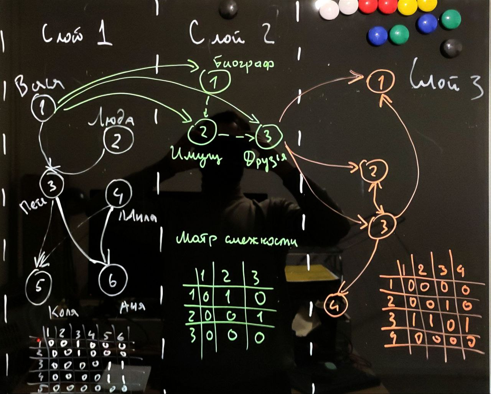

# pet graph

Пока все сыро!
Нет не переменных окружения ни тестов ни деплой и т.п.
Даже архитектуры как таковой нет :Р
## Структура проекта
- [ ] ./back будующий бэкенд
- [ ] ./front будующий фронтенд
- [ ] ./data временная эмуляция данных

### Для запуска заглушки data
В терминале в корне проекта запустить json-сервер
``` json-server --watch .\data\db_server_emulation.json


Движок решает заачу высокопроизводительных вычислений.

## Задачи движка
1. работа в с 'слоистой' струтурой данных
2. каждый слой сам по себе граф
3. слои связанны между собой так же как и сами графы
4. все слои можно развернуть в один полносвязный граф
5. каждая вершина 'верхнего слоя' имеет отображение в не менее чем одну вершину в 'нижнем слое' (подгаф в своем слое)
6. связи между подграфами в слое однозначно соответсвуют их связям между их отображениями в соседних слоях

## Архитектура движка
Предполагается реализовать луковичную архитектуру
- [ ] simple_graph\graph_core.go -- домен, бизнес-логика движка
- [ ]